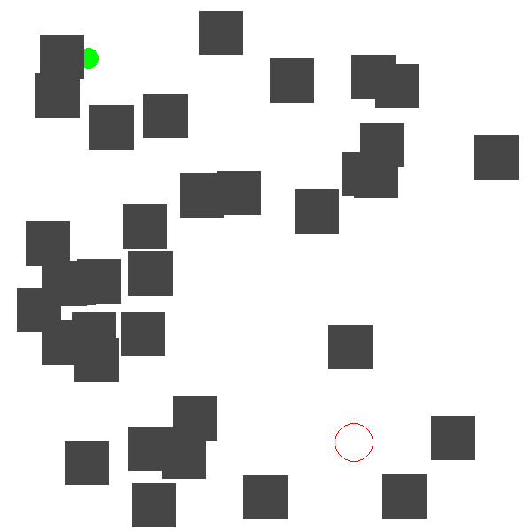
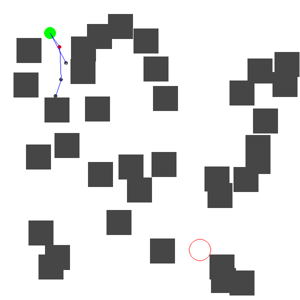
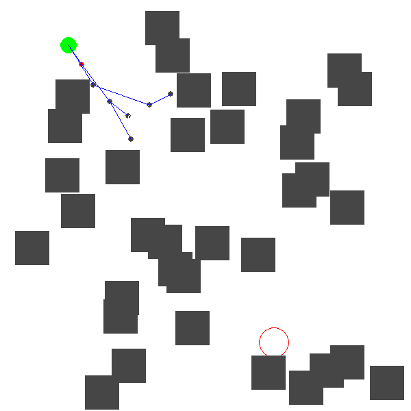
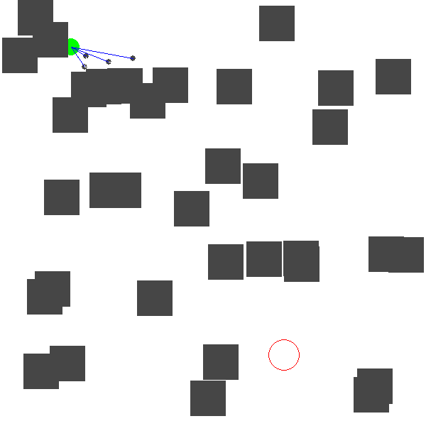

# RRT* and RRT path planning algorithim
- Learning and referencing from from [RRT theory and simulation](https://youtu.be/Oo61tjNJHCk?si=XyZY_cYtqLJ5F0fS) and [The RRT path planning algorithm simulated with python](https://youtu.be/TzfNzqjJ2VQ?si=8SRzWU3Vt19iLHKc)
## Development
- In addition to the RRT algorithm I learned from the above link, i also wrote and developed more about RRT* algorithm to get the minimal cost of path
## Result Of RRT* Algorithm

<strong><em>Result of 1000 iterations for making optimized path to goal

  

  

  

  

